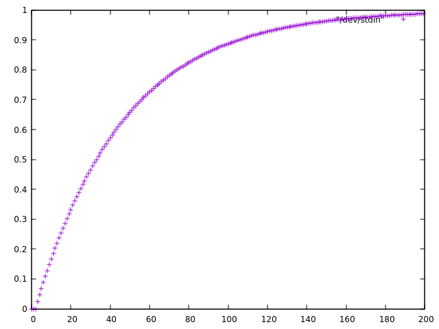

This program computes the probability that a given DNA motif (represented as
IUPAC codes) will occur inside a random DNA sequence of a given length.
It assumes that all four bases are equally likely and independent between the
positions.
It works as described in [this blog post](https://ro-che.info/articles/2018-08-01-probability-of-regex).

By default, it takes a BED file as an input and calculates the probability for
every interval based on its length.
With the `--raw` switch, it reads the list of sequence lengths (one per line) instead.

By default, it considers both the motif and its reverse complement.
With the `--norc` switch, it only considers the motif itself.

## Installation

1. [Install stack](https://docs.haskellstack.org/en/stable/install_and_upgrade/), a
   Haskell build tool
2. Run `stack install` inside a copy of this repository

`stack` will tell you where it installed the tool (typically, `~/.local/bin` or similar).

## Usage


```
Usage: motif-stats [-r|--raw] [--norc] [-i ARG] [-o ARG] MOTIF
  Calculate the probability of a motif occurrence in an interval

Available options:
  -h,--help                Show this help text
  -r,--raw                 take a list of interval lengths as an input (the
                           default is BED file)
  --norc                   consider only motif itself (default: consider also
                           its reverse complement
  -i ARG                   the input file (default: stdin)
  -o ARG                   the output file (default: stdout)
  MOTIF                    motif represented as a string of IUPAC codes
```

## Example

Let's calculate the probability with which the pattern `GCCB` (i.e.
`GCC(C|G|T)`) will occur in a random 100-nt string.

    % echo 100 | motif-stats -r GCCB
    0.6885116541460469

Do the same for all lengths from 1 to 200 and plot the results:

    % seq 1 200 | motif-stats -r GCCB | gnuplot -p -e 'plot "/dev/stdin"'


